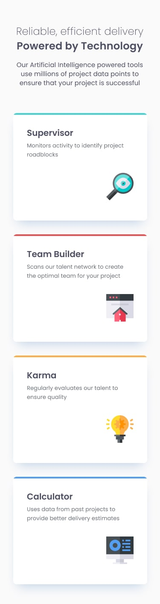

# Frontend Mentor - Four card feature section solution

This is a solution to the [Four Card Feature Section](https://www.frontendmentor.io/challenges/four-card-feature-section-weK1eFYK) challenge on Frontend Mentor. It's a responsive layout project built using **Tailwind CSS**, focusing on clean grid layout, consistent design tokens, and semantic HTML.

## 📌 Summary

This project presents four features in a clean, modern card layout. It was a great opportunity to strengthen my skills in utility-first CSS using Tailwind, practice responsive grid layouts, and improve semantic structure and visual hierarchy.

## 📸 Screenshots

### 🖥️ Desktop view

### 📱 Mobile view

## 🌐 Live Preview

- 🔗 **Live web page**: [https://michaeljara905.github.io/four-card-feature-section-master/](https://michaeljara905.github.io/four-card-feature-section-master/)
- 💻 **Source code**: [https://github.com/MichaelJara905/four-card-feature-section-master.git](https://github.com/MichaelJara905/four-card-feature-section-master.git)

## 🛠️ Technology Stack

- Semantic HTML5
- Tailwind CSS

## My workflow
### 📁 Project Setup

- Tailwind CSS is configured using an `input.css` file as entry point.
- Compiled using Tailwind CLI to generate `output.css`.
- Simple project structure, with semantic HTML and clear separation of styles and markup.

### 🧱 Structure and Layout

- Built with a responsive **CSS Grid** layout.
- Semantic HTML tags used for accessibility and readability.
- Tailwind utility classes (`grid-cols`, `gap`, `rounded`, `text-`, etc.) used throughout.

### 🎨 Styling

Custom HSL-based CSS variables:

    --color-Red: hsl(0, 78%, 62%);
    --color-Cyan: hsl(180, 62%, 55%);
    --color-Orange: hsl(34, 97%, 64%);
    --color-Blue: hsl(212, 86%, 64%);
    --color-Grey-500: hsl(234, 12%, 34%);
    --color-Grey-400: hsl(212, 6%, 44%);
    --color-White: hsl(0, 0%, 100%);

Font used:

    --font-Poppins: 'Poppins', sans-serif, system-ui;

### 🚀 Deployment

- You can deploy the project using GitHub Pages for quick preview and sharing.

## 📚 What I Learned

- How to structure components in a card layout with CSS Grid in Tailwind.
- Reinforced best practices for semantic and accessible markup.
- Practiced writing clean, scalable utility-first CSS.

## 🔍 What I Would Do Differently

- Add light/dark theme support using Tailwind's `dark:` variants.
- Include hover animations or transitions on cards.
- Modularize layout for integration into component-based frameworks like React/Vue.

## 👤 Author

- Frontend Mentor - [@MichaelJara905](https://www.frontendmentor.io/profile/MichaelJara905)
- Instagram - [@jaramillo_maicol_0](https://instagram.com/jaramillo_maicol_0)
- GitHub - [@MichaelJara905](https://github.com/MichaelJara905)

## ✅ Conclusion

This was a great challenge to apply my skills in Tailwind CSS and responsive layout. It helped me consolidate my understanding of utility-first design and HTML structure in a clean, real-world use case.